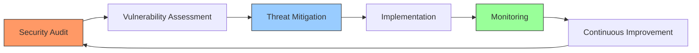

# Aty - Senior DevSecOps & Security Expert 🛡️

<div align="center">


</div>

## 👨‍💻 Professional Overview

With 15+ years of experience in Information Technology, I specialize in server administration, security hardening, and full-stack development. My expertise has helped numerous organizations secure their infrastructure and optimize their operations.

## 🔄 Security Workflow


## 🛡️ Core Expertise

### Security & Server Administration

```bash
#Common Security Hardening Steps
sudo apt update && sudo apt upgrade -y
sudo ufw enable
sudo fail2ban-client start
sudo chown root:root /etc/passwd /etc/shadow
sudo chmod 644 /etc/passwd && sudo chmod 600 /etc/shadow
```


### Cloud & Infrastructure
```javascript
// AWS IAM Policy Example
{
"Version": "2012-10-17",
"Statement": [{
"Effect": "Allow",
"Action": [
"s3:GetObject",
"s3:PutObject"
],
"Resource": "arn:aws:s3:::bucket-name/"
}]
}
```

### WordPress & E-commerce

```php
// WordPress Security Function Example
function secure_wordpress() {
// Disable XML-RPC
add_filter('xmlrpc_enabled', 'return_false');
// Remove WordPress version
remove_action('wp_head', 'wp_generator');
// Disable file editing
define('DISALLOW_FILE_EDIT', true);
}
add_action('init', 'secure_wordpress');
```

### Development & DevSecOps

```python
#Security Scanner Example
import subprocess
import json
def scan_dependencies():
try:
result = subprocess.run(['npm', 'audit', '--json'],
capture_output=True, text=True)
vulnerabilities = json.loads(result.stdout)
return analyze_vulnerabilities(vulnerabilities)
except Exception as e:
return f"Scan failed: {str(e)}"
```


## 🏆 Certifications & Achievements
- WPEngine Level 1 Support Certification
- Aviatrix ACE Certified
- Multiple CVE Reports
- Security Advisory Board Member

## 🔧 Services Matrix

| Service Category | Technologies | Expertise Level |
|-----------------|--------------|-----------------|
| Server Security | Linux, NGINX | ⭐⭐⭐⭐⭐ |
| Cloud Platforms | AWS, GCP, DO | ⭐⭐⭐⭐⭐ |
| WordPress       | WP, WooCommerce | ⭐⭐⭐⭐⭐ |
| Development    | Python, Bash | ⭐⭐⭐⭐☆ |
| DevSecOps      | CI/CD, Docker | ⭐⭐⭐⭐☆ |

## 📈 Success Metrics
- 99.9% Uptime for managed servers
- 100+ Security vulnerabilities identified and patched
- 50+ WordPress sites optimized and secured
- 30+ Custom security solutions implemented

## 📫 Connect With Me
[](mailto:atyinfosec@gmail.com)
[](https://www.linkedin.com/in/quinji/)
[](https://github.com/atyinfosec)
[](https://x.com/atyinfosec)
[](https://instagram.com/atyinfosec)

## 💼 Featured Projects

```bash
#Security Projects Structure
├── Server-Hardening-Suite
├── WordPress-Security-Scanner
├── Cloud-IAM-Manager
└── Malware-Detection-Tool

```


## 🤝 Why Choose Me?
- Industry-recognized security expert
- Proven track record with enterprise clients
- Comprehensive modern tech stack knowledge
- Results-driven approach
- Focus on scalable, secure solutions
- Trusted by global businesses

---

<div align="center">

*Available for security consultations, server administration, and development projects*

[](mailto:atyinfosec@gmail.com)

</div>
